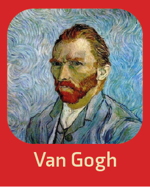
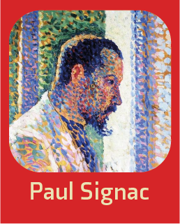
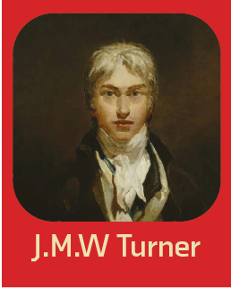
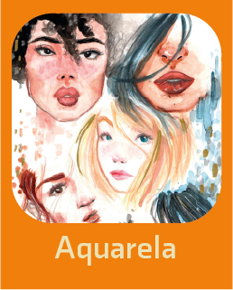
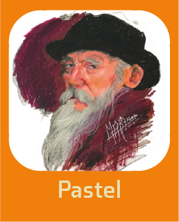
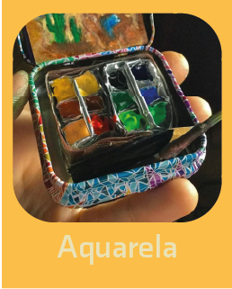
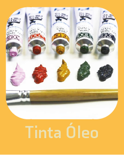
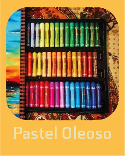
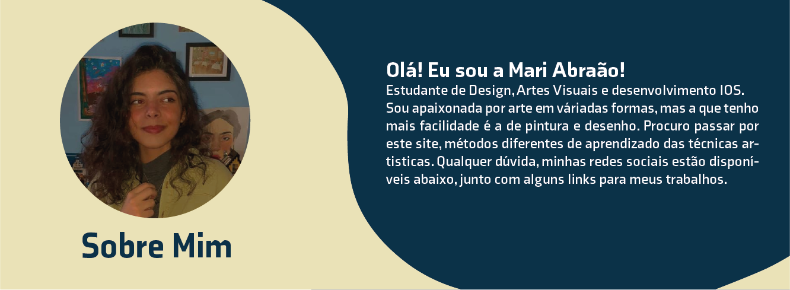
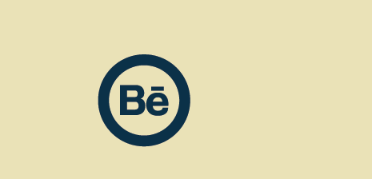

<!DOCTYPE html>
<html lang="pt-br">
    <head>
        <meta charset="utf-8">
        <title>Arte em você</title>
       <link rel="stylesheet" href="css.css">
       <link rel="stylesheet"
          href="https://fonts.googleapis.com/css2?family=Crimson+Pro">
    
    
    </head>
    <body>
       

        

            <a href="a" class="logo">
                <i class="logomarca"></i>
            </a>
            <ul class="menu">
                <li class="menu_li">
                    <a href="#icone" class="menu__link">Temas</a>
                </li>
                <li class="menu_li">
                    <a href="#corres" class="menu__link">Contato</a>
                </li>
                
                <li class="menu_li">
                    <a href="#sobremim" class="menu__link">Sobre mim</a>
                </li>
                <li class="menu_li">
                    <a href="#redes" class="menu__link">Redes Sociais</a>
                </li>
            </ul>
            

                          
                          
                          
                
        
            

                
                
                
                    
                        
            

                            
            

                
                    
                        
                            

                            
                                
            

                            
            

                
                    
                        
                            
                                
                                    
            

                            
            

                
                
                    
                        
                            
                                
            

        

                  
        
        

           <table>
               <tr></tr>
            <form class="correspforma" action="Site arte.html" method="POST">
               <th> </th>
               <th> <input type="" name="" class="email" value="" placeholder="Seu E-mail">  
                <input type="" name="" class="desenho" value="" placeholder="Arraste seus arquivos:">
       

         
          <button type="" name="">
              
           </button></th>
           

            
            <th> 
                 
        
        </th>
        </form>
    </tr>
    </table> 
        

         
       
        
          
        

           
           
            
            
        

            
    </body>
</html>
